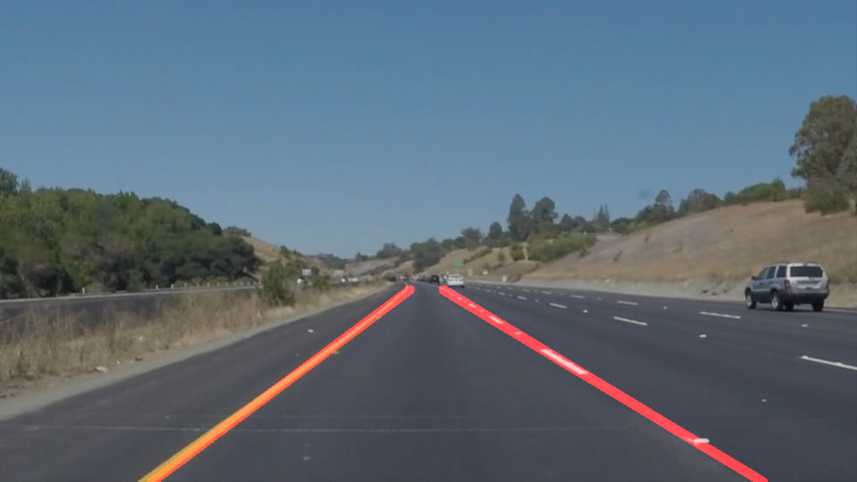

# **Finding Lane Lines on the Road**

__Please look at the notebook `P1-final` for the code to be reviewed__

Overview
---
When we drive, we use our eyes to decide where to go.  The lines on the road that show us where the lanes are act as our constant reference for where to steer the vehicle.  Naturally, one of the first things we would like to do in developing a self-driving car is to automatically detect lane lines using an algorithm.

In this project the aim is to detect lane lines in images using Python and OpenCV.

The Project
---

### Reflection
I faced difficulty in extrapolating the lines. Learned that converting the averaged values to int was forcing some slopes to go to 0. After this was solved I found that certain lines returned by the Hough transform were being classified as only left or only right. Tweaking both the slope classification as well as Hough parameters fixed this issue. Trying to solve the challenge video showed my vertices for the polygon mask will only work for 960x540 image. Changed these from absolute values to values that are dependent on the size of the image. Tweaked these values to accomodate the curvature of the challenge video. Currently, this pipeline only works for 4 seconds of the challenge video. 

##### 1. The Pipeline

My pipeline consisted of the following steps.
1. Convert to grayscale
2. Perform Gaussian Smoothing
3. Apply Canny Edge Detection to smoothed image
4. Apply a polygon mask to the edge detected image
5. Run a Hough transform on the masked edge detected image
6. Draw the lines on the image

##### 2. The `draw_lines()` function

In order to draw a single line on the left and right lanes, I modified the `draw_lines()` function.
1. For each line returned by Hough tranform, the slope and intercept is calculated. The lines were classified as left and right based on their slope values. Some lines are rejected for extreme slope values which don't make sense for lane lines. 
2. Having obtained the slope and intercept for left and right lines separately, the mean slope and intercept is calculated for each. 
3. A simple function `extrapolate` is defined to extrapolate lines given the slope, interecept and image size (image size is used to determine the top and bottom of the region of interest). 
4. These extrapolated lines are drawn on the blank image, which is then superimposed on the original image using `cv2.addweighted()`

__Sample Output__

##### 3. Potential shortcomings of current pipeline
1. It produces jittery output that is not smooth. This can be rectified by implementing a memory of sorts to store and average the extrapolated line values. 
2. It only fits straight lines. 
3. ~~It works only for one image size~~ [FIXED]

##### 4. Possible improvements to current pipeline
1. Implement Memory. 
2. Complete the challenge video [currently only works for 4 seconds]
3. Try to fit lane lines that curve. 
4. Reduce jitter when image has tree shadows, cement, etc. 

